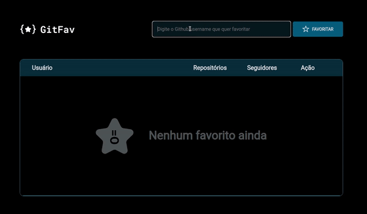
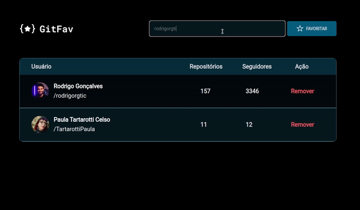

# GitFav

**Aplicação desenvolvida para adicionar e guardar os usuários favoritos do Github.**

&nbsp;
# Pré visualização

**Ao adicionar um usuário, a aplicação irá diferenciar letras maiúsculas de minúsculas, sendo assim, ao tentar inserir o mesmo usuário, um alerta irá impedir de prosseguir.**

&nbsp;

**Atingindo 4 usuários, a aplicação irá inserir uma barra de rolagem para facilidar o uso.**

&nbsp;

# Sobre

**Essa aplicação SPA (Single Page Application) faz uma comunicação entre o front-end e a API do Github, acessamos o banco de dados (em Json) e é retornado a informação solicitada para a criação da tabela.**

[Clique aqui para acessar !](https://gitfav-2.vercel.app)

&nbsp;
# Tecnologias

&nbsp;

# Conceitos aplicados no Projeto

- Tabelas no HTML.
- Classes para  visualização do HTML, comunicação com o Github, lógica dos dados.
- Assincronismo : `await` ,`try` , `catch` , e `throw`.
- Função `fetch()`.
- Promisses.
- API Github.
- Clean Code.
- Programação Orientada a Objetos (POO).
- LocalStorage.

&nbsp;
#  Contato

- paula.tcelso@gmail.com
- [LinkedIn.](https://www.linkedin.com/in/paulatartarotticelso/)
